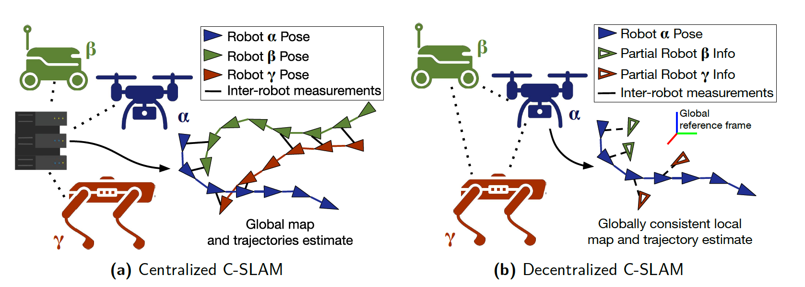

# Collaborative VSLAM

## why need collaborative vslam?
* to achieve better robustness, efficiency and accuracy than single-agent vslam
* some situations:

    * Three dimensional maps produced from different drones are required to be fused to speed up the mission of exploration
    * For multi-user augmented/virtual reality (AR/VR), the user should also know the state of other users, and different users should be put into a unified coordinate system such that virtual objects can be seamlessly displayed at different individual devices
    * A potential solution to solve the challenge of dynamic environment in multi-agents

## categories
### centralized vs. decentralized or distributed

* centralized architecture

    * most collaborative vslam papers
    * consist of the agent-side frontends and one server-side backend. The frontends are usually responsible for the computation of the real-time states of agents that are critical for online applications. The backend in the server is usually in charge of map fusion, simplification, and optimization.
    * centralized architecture is easy to be implemented and deployed compared with the distributed architecture
    * disadvantage:

        * high communication load
        * need a powerful server
    * improve: ruduce data communication load and compute in local as far as possible

* decentralized or distributed architecture

    * need to consider bandwidth constraints and limited onboard computational resources

### filter based method vs. key-frame based method
* filter based method

    * estimate camera pose and landmark coordinate simultaneously via EKF
    * implement easier, but low accuracy
* key frame based method

    * most popular framework in vslam
    * separates the camera pose tracking that requires real-time computation from the time-consuming mapping tasks in the key-frame based framework to make the visual SLAM system highly efficient
    * high accuracy